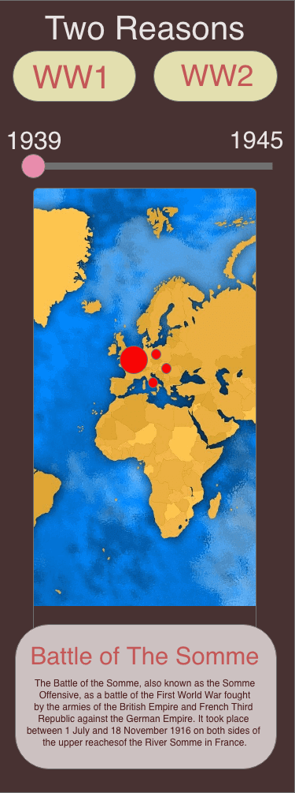
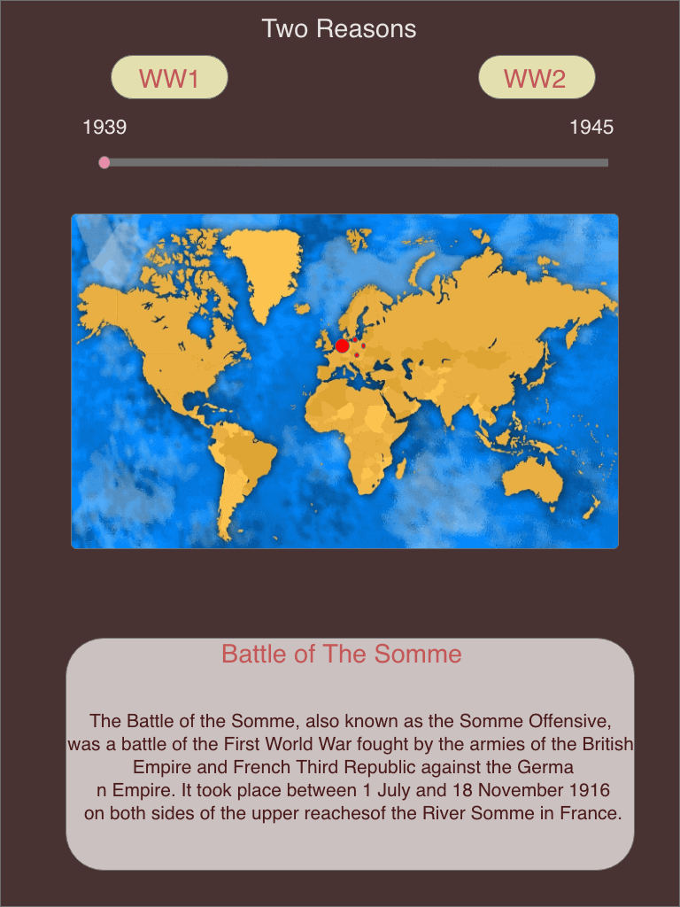
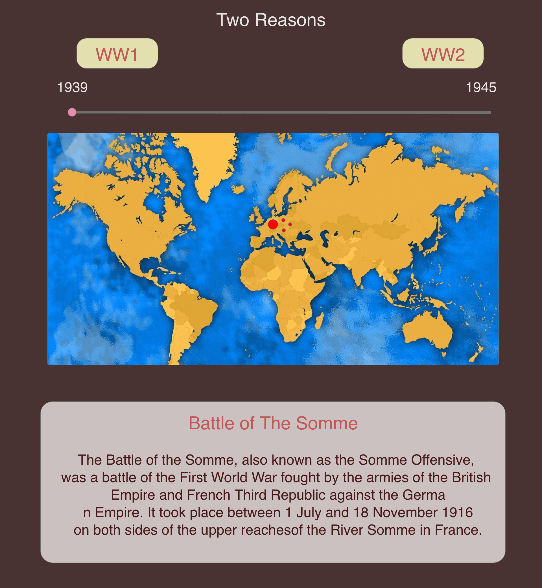
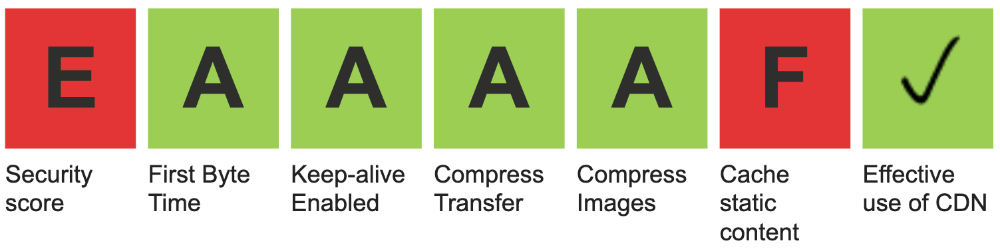
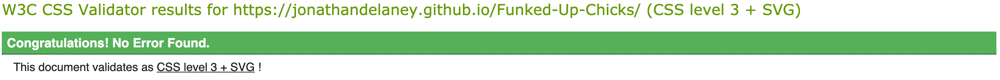
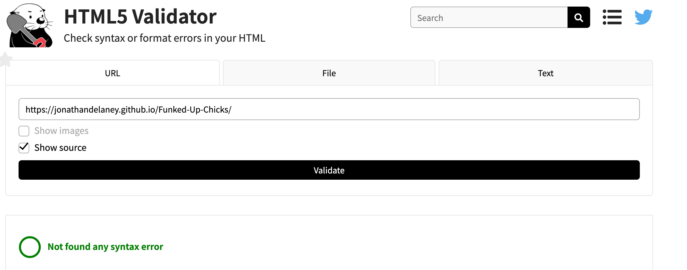

<h1 align="center">Two Reasons</h1>

Live website :arrow_down: 

## About

This is an educational tool for learning about the world wars. It could be used by school students or even university students who wish to broadly visualise the progression of the wars and interact with the timeline of events.

## User Stories

- The lay person

  - I want to be able to get an idea of what the wars were about, why they started and ended etc.
  - I want to be able to navigate the site and map easily, to see the wars play out as I have no interest in a specific event.
  - The website should intrigue me or at least make the content interesting to sift through.

- Secondary School Student

  - I want to be able to study the wars easily and get a general grasp of the sequence of events.
  - I should be able to access the dates of events and some information about each.
  - I want to be able to see all the types of battles that took place and where they took place.
  - There is a specific event that I would like to learn more about and know what else was happening before, at the time and after.

- Third Level Student
  - I would like to get a fresh perspective on some events and look at them in context of what was happening around the world at the time.
  - I would like to be able to access in depth information about the battles easily.
  - I should be able to provide feedback to the site authors if there is something, of importance, inaccurate or missing.
  - I could do with a tool to use alongside more academic material to be able to jump to the specific time and have an overview of the war, at that time, to broaden my perspective on the event I'm studying.

## Design and Creation

In the process of brainstorming for a new project, I thought controlling time with a slider and animating a map to evolve through time would be very cool to see. Originally I wanted to create a map that would allow the user to look at all the wars that took place over the 20th century, allowing them to drag an icon across the slider to go from 1901 to 2000, year by year, and look at the battles that took place during that year. I wanted to use the wikipedia api to achieve this as there were too many battles to collect the data manually. As you've probably guessed, I failed in this effort as I couldn't effectively parse the information from the wikipedia pages so I had to settle for doing the two world wars. 
 
 
Collecting the data 'by hand' was a labour of love. I enjoyed researching the wars and finding the most prominent events to include. Naturally this took a good bit of effort but luckily I enjoyed the process. The information I organised into data could be useful for others to use if they want to do a project on the wars and so I felt it very worthwhile in the end.
 
 
Originally I had just intended on doing a year by year of the whole century but having decided on the two wars, the resolution of my slider increments had to be on the order of days. The process of using (pre 1970) dates in milliseconds along with a slider proved a challenge but a rewarding one to overcome. The option to select weekly and monthly, and so on, increments also required some thought to implement correctly and having no working example to go off for any of this it proved to be a great project for learning the extent to which JavaScript could be used to toy around with data.
 
 
I wanted to be as respectful as possible when presenting the website to the user as the events that I was looking to represent were horrific in nature and if not sensitively portrayed could offend the user and trivialise those events. In this endeavor I used the least glitsy animation and kept the aesthetics of the website quite muted and had enough for the user to be kept engaged. It being designed as a sortt of study tool lent itself to that sort of design also. The introduction I wrote reflected this, I thought it necessary to preface the presentation of such serious events with my clear intentions.

## Mockups

- Having gone through a few different ideas for the project I just did very rough mockups, in case my idea would change again. It did. A lot.
- You can see the dramatic difference between the two. I kept on adding features and things which turned the project into something a lot more complicated than i had planned at any point. When I added in the different increments there were buttons to along with them, a key when I thought of using custom images for the markers on the map, etc.

* ### Mobile

* ### Tablet

* ### Desktop

## Features

* ### Introduction

    - The Introduction page was originally going to be dedicated to the key and instructions on how to use the map, however I thought it better to have the key and instructions closer to the map, thus the introduction page became an introduction to the wars and my authorship of the website.
    - The spiel in the statment goes on a bit but i felt it all necessary to say. I tried to keep it centered around the wars and to allow the users to click on either of the globes without having read the introduction if they wanted. The different type face at the bottom a more clear instructional one to draw attention to it if the user was looking to navigate away they would get instructions from it.

* ### Main Page

    - The main page changed dramatically over the course of the creation of the website. I structured it simply giving the map center stage and other features built around it (literally and figuratively).
    - The Key and buttons above, and the battle information below gives the user the most intuitive and easiest to navigate layout. The most important feature in the center and the other parts either side. Reading down through the key, instructions and settings to reach the map which they would then begin to manipulate.
    - The slider I styled with the Aircraft as the thumb which I thought was suggestive of a plane flying over land. This has the appropriate dates above which should make its purpose obvious to the user.
    - The responsiveness of the website allows the globes to switch from being either side of the key to being above the key but still either side of eachother. The rest of the content just becomes wider and more spaced out on smaller screen sizes and some content becomes hidden such as the daily and weekly buttons and the flags in the info box below. The daily and weekly increments are too small to engage with properly on smaller screens and the flags unnecessary and just a bit too much on smaller screens.
    - When the user clicks on a marker on the map it auto scrolls down to the info box which has loaded the information about the war. This I determined to be a better method than having a visual indicator appear prompting the user to scroll down as the map I felt had enough clutter on and around it.
    - The Info table which appears below the map gives the necessary details of the battle; the start and end date, the allies and adversaries which fought in the battle, their corresponding flags on flagpoles either side and a brief description.
    - The header in the table has a wikipedia globe above it which should be enough of an indicator to the user that if they click it or the heading it will lead the to a wikipedia page about that battle. Any further indicating of such, I felt, would be obtrusive.
    - In the upper right corner of the page I placed the contact link. This is in the style of an envelope which is a strong visual cue for the user. It's position on the screen keeps it out of the way but yet easy to find if the user wants to.

* ### The Contact Page

    - I tried to keep this page simple as I wanted the least possible distractions to take away from their experience of the main page. This page weas for feedback and nothing more. The user would submit their feedback without distractions.
    - The background I kept as the same throughout the website just changing the tone I blended with it. This helped keep uniformity throuhgout the website and a thread of familiarity for the user wherever they navigated to.
    - If the feedback they gave successfuly, sent they would receive a thank you message on the page and a link to return home. If the feedback failed to send, an alert would pop up, the entry fields would clear and they would be asked to try again.

## Technologies Used

### Languages Used

-   HTML5
-   CSS3
-   JavaScript + jQuery

### APIs Used

-   Google Maps API
-   EmailJS

### Frameworks and programmes used

- Gitpod was the IDE used to code the website.
- AdobeXd for the design of the mockups.
- Vectr to edit images for free.
- TnyJPG to compress images.

## Testing

### User experience

- Friends and Family

    - I asked friends and family of all different ages and abilities to play around with the website and explore its features. No issues were found in the final round of testing. 
    - Some issues were detected in this phase of testing. Responsiveness on other unusual screen sizes needed tweeking and some minor improvements made to the usability of the maps off the back of the feedback.

- The Lay Person

  - I want to be able to get an idea of what the wars were about, why they started and ended etc.
    - The political events on the map give this user some information from the outset as to why/how the wars began and likewise finished if they travelled to the end.
  - I want to be able to navigate the site and map easily, to see the wars play out as I have no interest in a specific event.
    - The Key and instructions give a good brief explanation of what to look out for on the map. The slider is brightly coloured and the dates above it givce the user all they need to get started manipulating it.
  - The website should intrigue me or at least make the content interesting to sift through.
    - The gentle animations on the interactive parts of the page should attract the eye of the user and keep them entertained by the activity they can create on the map.

- Secondary School Student

  - I want to be able to study the wars easily and get a general grasp of the sequence of events.
    - The fact the student can choose the interval/time period they'd like to search with means that they can get a very broad overview if they'd like or even just look at the whole war. And the sequence of events would be clear by using the slider.
  - I should be able to access the dates of events and some information about each.
    - The info box that opens below gives a secondary school level student almost all they would ever need to know about each battle. The flags add an extra learning aspect and memorisation tool.
  - I want to be able to see all the types of battles that took place and where they took place.
    - The map is an innovation on that front. With custom markers for each type of warfare and the slider allowing full control over the timeline, the user can see what types of battle were happening when, and where they were happening.
  - There is a specific event that I would like to learn more about and know what else was happening before, at the time and after.
    - The website is missing a search bar which is something I may come back to add in the future but as it stands if the user knows when an event took place they can go to that time period or if they know where it happended then they can look at the whole war and go to that location on the map. The info box would then allow them to research what was taking place around the period of that battle without navigating away from the page.

- Third Level Student

  - I would like to get a fresh perspective on some events and look at them in context of what was happening around the world at the time.
    - The site offers people with very good knowledge of the wars a way to look at them from a different angle as this sort of tool has never been created. They can take a very broad look at the wars or look at the world as it was on a specific day and the battles which were taking place elsewhere.
  - I would like to be able to access in depth information about the battles easily.
    - The wikipedia link in the info box allows the user to navigate awayt quickly if they would like to study a battle in more depth. The link will open up in a new tab so they can continue searching for other relevant battles to study as well. 
  - I should be able to provide feedback to the site authors if there is something, of importance, inaccurate or missing.
    - As a user educated on the wars they can offer feedback through the contact page and perhaps see changes they suggest be introduced. At least battles that have been missed altogether can be added in easily and the website can be constantly improved by feedback from academics.
  - I could do with a tool to use alongside more academic material to be able to jump to a specific time and have an overview of the war, at that time, to broaden my perspective on an event I'm studying.
    - The maps allow for the user to have a look around the world and at events contemporaneous to the one they're studying, the visual aspect of the tool allows them to go back and forth to see the run up and aftermath, all from a broad perspective.

### Performance Testing

Testing of the webpage was carried out using <a href="https://www.webpagetest.org/">webpagetest.org</a>
 
The images had to be compressed alot, however i changed one problematic image to png and this worked a lot better. In future i may stick to png.
 
 
The CSS validating was done using <a href="https://jigsaw.w3.org/css-validator/">W3</a> 

 
 
The Html validating was done using <a href="https://en.rakko.tools/tools/58/">Rakko</a> 
 

 - The Introduction - Pass
 - The Main Page - Pass
 - The Contact Page - Pass

### Compatibility Testing
- Browser Compatibility

    | Screen size\Browser | Safari           | Opera            | Microsoft Edge   | Chrome           | Firefox          | Internet Explorer |
    | --------------------|:----------------:|:----------------:|:----------------:|:----------------:|:----------------:|:-----------------:|
    | Mobile              |:heavy_check_mark:|:heavy_check_mark:|:heavy_check_mark:|:heavy_check_mark:|:heavy_check_mark:| Not Tested        |
    | Desktop             |:heavy_check_mark:|:heavy_check_mark:|:heavy_check_mark:|:heavy_check_mark:|:heavy_check_mark:| Not Tested        |
    | Tablet              |:heavy_check_mark:|:heavy_check_mark:|:heavy_check_mark:|:heavy_check_mark:|:heavy_check_mark:| Not Tested        |

## Deployment

### Publishing
I published the website by following the instructions below.
1. Go to the GitHub website and log in.
2. On the left-hand side, you'll see all your repositories, select the appropriate one. ([Repository](https://github.com/JonathanDelaney/Two-Reasons) used for this project).
3. Under the name of your chosen Repository you will see a ribbon of selections, click on 'Settings' located on the right hand side.
4. Scroll down till you see 'GitHub Pages' heading.
5. Under the 'Source' click on the dropdown and select 'master branch'
6. The page will reload and you'll see the link of your published page displayed under 'GitHub' pages.
7. It takes a few minutes for the site to be published, wait until the background of your link changes to a green color before trying to open it.

### Forking
If someone wants to add to the project they can fork off the main branch by following the instructons below.
1. Go to the GitHub website and log in.
2. Locate the [Repository](https://github.com/JonathanDelaney/Funked-Up-Chicks) used for this project.
3. On the right-hand side of the Repository name, you'll see the 'Fork' button next to the 'Star' and 'Watch' buttons.
4. This will create a copy in your personal repository.
5. Once you've finished making changes you can locate the 'New Pull Request' button just above the file listing in the original repository.

### Cloning 
For someone looking to clone the repository they would follow the steps outlined below.
1. Go to the GitHub website and log in.
2. Locate the [Repository](https://github.com/JonathanDelaney/Funked-Up-Chicks) used for this project.
3. Under the Repository name locate 'Clone or Download' button in green.
4. To clone the repository using HTTPS click the link under "Clone with HTTPS".
5. Open your Terminal and go to a directory where you want the cloned directory to be copied in.
6. Type `Git Clone` and paste the URL you copied from the GitHub.
7. To create your local clone press `Enter`.

## Credits

I sourced images from [pixabay.com](https://pixabay.com/) and [freepngimg.com](https://freepngimg.com/) None of the images used require license to publish.
I looked at a lot of youtube videos with mixed input from too many to name.  
Of course I have to mention the course material was referenced and an honorable mention should be made to all the contributors to the CodeInstitute's course material. 
Also to the good people in the slack group chats who helped out with general feedback.
Thank you.